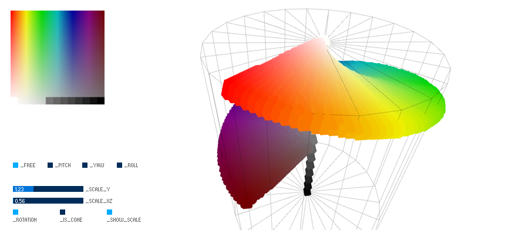

# colorspace
3D Colorspace Visualisation in HSB Space

Video: https://www.youtube.com/watch?v=EUrU_-gktu4

## Requirements 
* [Processing 3](https://processing.org/)
* Processing Lib: [PeasyCam](http://mrfeinberg.com/peasycam/) 
* Processing Lib: [ControlP5](http://www.sojamo.de/libraries/controlP5/)

## How to use
* Input images are located inside the "in"-folder
* Screenshots can be taken via [Enter]

## Camera Controls:
* Spin: Left Mouse
* Move: Middle Mouse
* Zoom: Right Mouse/Mousewheel
